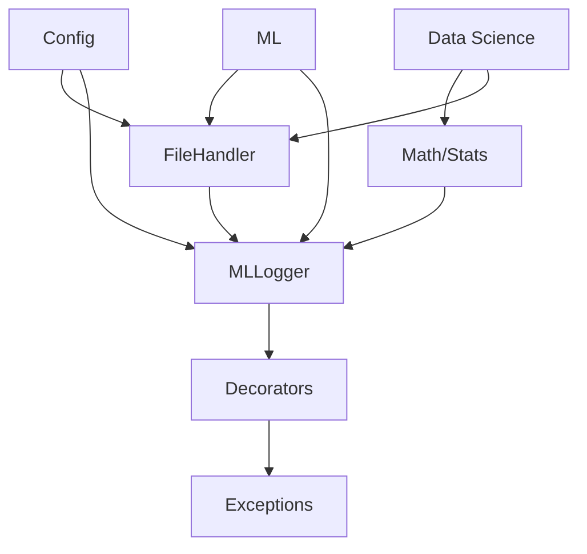

# 🚀 Refunc - ML Utilities Toolkit

> **A comprehensive, production-ready ML utilities toolkit designed to accelerate machine learning development with robust, reusable components and professional development practices built-in.**

[](https://www.python.org/downloads/)
[](https://opensource.org/licenses/MIT)
[](https://github.com/psf/black)

[](https://github.com/kennedym-ds/refunc/actions/workflows/ci.yml)
[](https://github.com/kennedym-ds/refunc/actions/workflows/pre-commit.yml)
[](https://github.com/kennedym-ds/refunc/actions/workflows/docs.yml)
[](https://codecov.io/gh/kennedym-ds/refunc)

## 🎯 Overview

Refunc is a comprehensive ML utilities toolkit that provides essential building blocks for machine learning projects. From intelligent file handling and advanced logging to robust exception management and performance monitoring, Refunc eliminates boilerplate code and provides production-ready utilities that scale with your projects.

**🚀 [Quick Start Guide](docs/guides/quickstart.md)** | **📖 [Full Documentation](docs/README.md)** | **🔧 [Installation Guide](docs/guides/installation.md)**

## ✨ Key Features

### 🏗️ **Core Architecture**

- **Modular Design**: Independent utilities that work together seamlessly
- **Type Safety**: Comprehensive type hints throughout for better IDE support
- **Production Ready**: Thread-safe, tested, and optimized for real-world usage
- **Cross-Platform**: Full support for Windows, macOS, and Linux

### 📦 **Module Overview**

| Module | Purpose | Key Features |
|--------|---------|--------------|
| **🔧 Utils** | File operations & data handling | Auto-format detection, smart caching, batch processing |
| **📝 Logging** | ML-specific logging framework | Experiment tracking, colored output, metric logging |
| **⚠️ Exceptions** | Robust error handling | Custom ML exceptions, retry mechanisms, graceful recovery |
| **⚡ Decorators** | Performance monitoring | Timing, memory profiling, caching, input validation |
| **⚙️ Config** | Configuration management | YAML/JSON support, environment variables, validation |
| **📊 Math/Stats** | Statistical utilities | Hypothesis testing, bootstrapping, outlier detection |
| **🤖 ML** | Machine learning helpers | Model utilities, pipeline components, evaluation metrics |
| **🔬 Data Science** | Data analysis tools | Preprocessing, feature engineering, visualization helpers |

## 🏃‍♂️ Quick Start

### Installation

```bash
# Basic installation
pip install refunc

# Development installation
git clone https://github.com/kennedym-ds/refunc.git
cd refunc
pip install -e .
```

### Essential Usage

```python
from refunc import MLLogger, time_it, memory_profile, FileHandler
from refunc.exceptions import retry_on_failure
from refunc.math_stats import StatisticsEngine

# 1. Smart file operations
handler = FileHandler()
data = handler.load_auto("data.csv")  # Auto-detects format
all_data = handler.batch_load("./datasets/*.{csv,json}")

# 2. Performance monitoring
@time_it
@memory_profile(track_peak=True)
@retry_on_failure(max_attempts=3)
def train_model(data):
    # Your ML training code
    return model

# 3. Professional logging
logger = MLLogger("experiment_001")
logger.log_metrics({"accuracy": 0.95, "loss": 0.23})
logger.log_hyperparams({"lr": 0.001, "batch_size": 32})

# 4. Statistical analysis
stats = StatisticsEngine()
results = stats.hypothesis_test(data1, data2, test_type="t_test")
outliers = stats.detect_outliers(data, method="iqr")
```

## 🏗️ Architecture & Design

### Core Principles

- **🎯 Purpose-Built**: Designed specifically for ML workflows and common pain points
- **🔒 Reliability**: Comprehensive error handling with graceful degradation
- **⚡ Performance**: Optimized for speed with intelligent caching and lazy loading  
- **🧩 Modularity**: Use only what you need - no forced dependencies
- **📈 Scalability**: From prototypes to production environments

### Module Interactions



## 📖 Documentation

| Resource | Description |
|----------|-------------|
| **[📖 Main Documentation](docs/README.md)** | Complete documentation portal with navigation |
| **[🚀 Quick Start](docs/guides/quickstart.md)** | 5-minute getting started guide |
| **[🔧 Installation](docs/guides/installation.md)** | Detailed installation instructions |
| **[📚 API Reference](docs/api/)** | Complete API documentation for all modules |
| **[💡 Examples](docs/examples/)** | Practical usage examples and tutorials |
| **[🛠️ Contributing](docs/developer/contributing.md)** | Development guidelines and workflow |

### API Documentation

- **[⚠️ Exceptions Framework](docs/api/exceptions.md)** - Error handling and retry mechanisms
- **[📊 Math & Statistics](docs/api/math_stats.md)** - Statistical analysis and hypothesis testing
- **📝 Logging** *(coming soon)* - ML-specific logging and experiment tracking
- **⚙️ Config** *(coming soon)* - Configuration management utilities
- **⚡ Decorators** *(coming soon)* - Performance monitoring decorators
- **🔧 Utils** *(coming soon)* - File handling and data utilities

## 🚀 Repository Structure

```text
refunc/
├── 📁 docs/                     # 📖 Complete documentation
│   ├── README.md               # Documentation portal
│   ├── 📁 api/                 # API reference docs
│   ├── 📁 guides/              # User guides
│   ├── 📁 examples/            # Usage examples  
│   └── 📁 developer/           # Developer docs
├── 📁 refunc/                   # 🎯 Main package
│   ├── __init__.py
│   ├── 📁 utils/               # File & data utilities
│   ├── 📁 logging/             # ML logging framework
│   ├── 📁 exceptions/          # Exception handling
│   ├── 📁 decorators/          # Performance decorators
│   ├── 📁 config/              # Configuration management
│   ├── 📁 math_stats/          # Statistical utilities
│   ├── 📁 ml/                  # ML-specific helpers
│   └── 📁 data_science/        # Data analysis tools
├── 📁 scripts/                  # 🔧 Setup & utility scripts
├── 📁 requirements/             # 📦 Dependency definitions
├── 📁 tests/                    # ✅ Test suite
└── 📁 examples/                 # 💡 Usage examples
```

## 🛠️ Development

### Quick Setup

```bash
# Clone and setup development environment
git clone https://github.com/kennedym-ds/refunc.git
cd refunc

# Auto-detected setup (works on all platforms)
python scripts/setup_venv.py --dev

# Manual setup
python -m venv venv
source venv/bin/activate  # or venv\Scripts\activate on Windows
pip install -r requirements/dev.txt
pip install -e .

# Install pre-commit hooks
pre-commit install
```

### Quality Assurance

- **🧪 Testing**: Comprehensive test suite with pytest
- **📏 Code Style**: Black, isort, flake8, mypy for consistent formatting
- **🔍 Type Checking**: Full type hints with mypy validation
- **🚀 CI/CD**: GitHub Actions for automated testing and deployment
- **📦 Pre-commit**: Automated quality checks on every commit

## 📊 Project Status

### Current Release: v0.1.0

**Core Features Complete:**

- ✅ Exception handling framework with retry mechanisms
- ✅ Mathematical and statistical utilities
- ✅ Basic file handling utilities
- ✅ Configuration management system
- ✅ Cross-platform setup scripts

**In Development:**

- 🚧 Advanced logging framework with ML experiment tracking
- 🚧 Performance monitoring decorators
- 🚧 Data science preprocessing utilities
- 🚧 ML-specific helper functions

See our **[📋 Changelog](CHANGELOG.md)** for detailed release notes and roadmap.

## 🤝 Contributing

We welcome contributions! Whether it's bug reports, feature requests, or code contributions, please see our **[🛠️ Contributing Guide](docs/developer/contributing.md)** for details on:

- Development environment setup
- Code style and testing requirements  
- Pull request process
- Issue reporting guidelines

## 📄 License

This project is licensed under the MIT License - see the [LICENSE](LICENSE) file for details.

## 🔗 Links

- **📖 [Documentation](docs/README.md)**
- **🐛 [Report Issues](https://github.com/kennedym-ds/refunc/issues)**
- **💡 [Feature Requests](https://github.com/kennedym-ds/refunc/issues)**
- **📧 [Contact](mailto:your.email@example.com)**

---

*Built with ❤️ for the ML community. Star ⭐ this repo if you find it helpful!*
